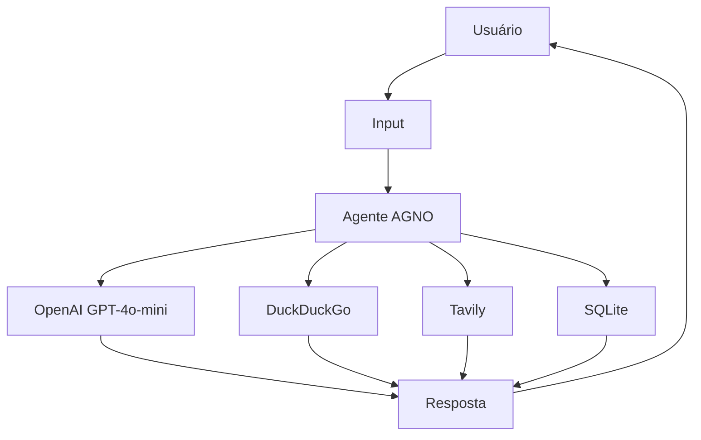

# 🤖 Explicação do Código — Agente IA com AGNO

Este projeto cria um agente de Inteligência Artificial utilizando o framework **AGNO**, com suporte a:

- 🔎 Pesquisas na internet
- 🗄️ Persistência em banco de dados SQLite
- 🧠 Memória de conversas
- 💬 Integração com modelo OpenAI
- 🌐 Ferramentas Tavily e DuckDuckGo

---

# 📦 Importações

## 🔎 Ferramentas de Pesquisa

```python
from agno.tools.duckduckgo import DuckDuckGoTools
from agno.tools.tavily import TavilyTools
```

Essas bibliotecas adicionam ferramentas de busca ao agente.

### DuckDuckGoTools
Permite que o agente faça pesquisas diretamente no mecanismo de busca DuckDuckGo.

Exemplo:
- Pesquisar notícias
- Buscar informações técnicas
- Consultar conteúdos online

---

### TavilyTools
Ferramenta avançada de pesquisa focada em IA e contexto.

Ela melhora:
- precisão das respostas
- contexto da busca
- informações atualizadas

---

# 🗄️ Banco de Dados SQLite

```python
from agno.db.sqlite import SqliteDb
```

Responsável por armazenar:
- histórico das conversas
- memória do agente
- contexto das sessões

O banco utilizado é SQLite, um banco leve que salva os dados em arquivo local.

---

# 🔐 Variáveis de Ambiente

```python
from dotenv import load_dotenv
```

Carrega variáveis do arquivo `.env`.

Exemplo:
```env
OPENAI_API_KEY=sua_chave
```

Isso evita deixar chaves sensíveis diretamente no código.

---

# 🤖 Classe Principal do Agente

```python
from agno.agent import Agent
```

Classe principal responsável por:
- criar o agente
- gerenciar memória
- usar ferramentas
- enviar prompts ao modelo IA

---

# 🧠 Modelo OpenAI

```python
from agno.models.openai import OpenAIChat
```

Define qual modelo da OpenAI será utilizado.

No código:
```python
OpenAIChat(id = "gpt-4o-mini")
```

O agente utilizará o modelo:
- GPT-4o Mini

---

# ⚙️ Carregando Variáveis de Ambiente

```python
load_dotenv()
```

Carrega automaticamente as variáveis definidas no arquivo `.env`.

---

# 🗄️ Criando Banco de Dados

```python
bancoDados = SqliteDb(db_file="temp/registros.db")
```

Cria um banco SQLite no caminho:

```bash
temp/registros.db
```

Esse banco armazenará:
- histórico
- contexto
- sessões do agente

---

# 🤖 Criando o Agente

```python
agente = Agent(
```

Inicializa o agente IA.

---

# 🧠 Modelo Utilizado

```python
model = OpenAIChat(id = "gpt-4o-mini")
```

Define o modelo de linguagem utilizado.

---

# 📝 Personalidade do Agente

```python
description = "Você é um técnico de informática..."
```

Define:
- comportamento
- personalidade
- estilo de escrita
- especialidade do agente

Nesse caso:
- técnico de informática
- respostas diretas
- uso de emoticons
- especialista em hardware

---

# 🧠 Histórico na Conversa

```python
add_history_to_context = True
```

Permite que o agente utilize mensagens anteriores para responder melhor.

Isso cria:
- memória contextual
- continuidade na conversa

---

# 🗄️ Banco Integrado

```python
db = bancoDados
```

Conecta o agente ao banco SQLite.

---

# 🆔 Session ID

```python
session_id="4b471813-b9af-4bac-a259-f586735d2f9f"
```

Identificador único da sessão.

Serve para:
- recuperar histórico
- manter memória persistente
- continuar conversas antigas

---

# 🔄 Quantidade de Histórico

```python
num_history_runs=7
```

Define quantas mensagens anteriores serão utilizadas no contexto.

Nesse caso:
- últimas 7 interações

---

# 🔧 Ferramentas do Agente

```python
tools = [DuckDuckGoTools(), TavilyTools()]
```

Adiciona ferramentas externas ao agente.

Ferramentas disponíveis:
- DuckDuckGo Search
- Tavily Search

O agente poderá pesquisar automaticamente na internet quando necessário.

---

# 📄 Respostas em Markdown

```python
markdown = True
```

Faz o agente responder utilizando Markdown.

Melhora:
- formatação
- leitura
- organização das respostas

---

# 🔁 Loop Infinito de Conversa

```python
while True:
```

Mantém o chat funcionando continuamente até o usuário sair.

---

# ⌨️ Entrada do Usuário

```python
pergunta = input("Insira texto: ")
```

Recebe perguntas digitadas pelo usuário.

---

# ❌ Encerrando Programa

```python
if (pergunta.lower() in ['sair', 'exit', 'não']):
    break
```

Fecha o programa caso o usuário digite:
- sair
- exit
- não

---

# 💬 Resposta do Agente

```python
agente.print_response(pergunta)
```

Envia a pergunta para o agente e imprime a resposta formatada.

O agente poderá:
- responder usando IA
- consultar internet
- usar memória
- acessar histórico

---

# 🚀 Fluxo Completo do Sistema



---

# ✅ Resumo

Este código cria um agente de IA capaz de:

- 🧠 Manter memória de conversa
- 🌐 Pesquisar na internet
- 🗄️ Salvar histórico
- 🤖 Utilizar OpenAI GPT
- 💬 Conversar continuamente
- 📄 Responder em Markdown

```